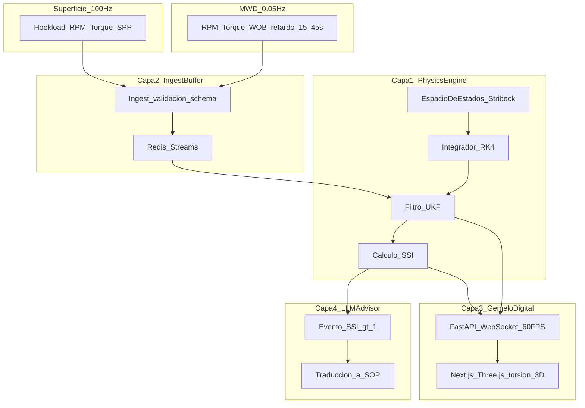

# SPEC.md — Especificación técnica (SSOT)

**Proyecto:** Drilling Telemetry Engine  
**Repositorio:** `IES9018/lautaro_lopez-drilling-telemetry-engine`  
**Asignatura:** Práctica Profesionalizante III (PP3) · IES 9-018 · Ciclo 2026  
**Sprint 1:** 24 ago – 18 sep 2026  
**Versión del documento:** 6.0.0  
**Estado:** **Congelado para defensa ADI** — baseline PP3 Sprint 1 + entregables TP1–TP6

Este documento es la **Single Source of Truth** técnica. Cualquier cambio de modelo, contrato o arquitectura debe actualizarse aquí antes o en el mismo PR que el código.

Gobernanza: [`.cursor/rules/`](.cursor/rules/) · Operación: [`INSTRUCTIONS.md`](INSTRUCTIONS.md)

---

## 1. Especificación declarativa

### 1.1 Contexto y propósito

**Contexto institucional.** Proyecto integrador de la Práctica Profesionalizante III (PP3 — Ciclo 2026, IES 9-018, Prof. Paulo Alvarez). Repositorio individual: `lautaro_lopez-drilling-telemetry-engine` (org `IES9018`). Marco inmediato: **Sprint 1** (24 ago – 18 sep 2026).

**Contexto de dominio.** En perforación petrolera profunda (Upstream Oil & Gas), la sarta transmite energía rotacional desde superficie hasta la broca. El **Stick-Slip** es una inestabilidad torsional no lineal: la broca se frena por fricción estática (*stick*) y se libera violentamente (*slip*), acelerando desgaste de broca/BHA, elevando **NPT** y riesgo mecánico. El diagnóstico en tiempo real se complica por la **disparidad de telemetría**:

| Origen | Tasa típica | Latencia | Señales |
|--------|-------------|----------|---------|
| Superficie | **100 Hz** | **&lt; 50 ms** | Hookload, RPM, Torque, Standpipe Pressure |
| Fondo (MWD / Mud Pulse) | **~0.05 Hz** | **15–45 s** (retardo acústico) | RPM/torque de fondo, WOB |

**Propósito.** Construir un **motor de estimación de estado en tiempo real** y **gemelo digital** — no un CRUD web — que fusione superficie rápida + MWD lento, estime RPM/torque reales en fondo, cuantifique severidad Stick-Slip (SSI) y exponga el estado a visualización 3D y a un asesor LLM activado por eventos críticos.

**Resultado esperado del sistema (visión PP3):**

1. Modelo de sarta en espacio de estados (FEM / lumped parameters) con fricción **Stribeck**.
2. Integración no lineal con **RK4** propio (determinista, vectorizado).
3. Fusión sensorial con **UKF** propio.
4. Cálculo de **SSI** y alerta cuando `SSI > 1.0`.
5. Streaming del estado estimado (WebSocket ~60 FPS) hacia gemelo 3D (Next.js / Three.js).
6. **LLM Advisor** que traduzca anomalías críticas a protocolos operativos (SOP).

### 1.2 Requerimientos funcionales

| ID | Requerimiento | Prioridad Sprint 1 | Dominio |
|----|---------------|--------------------|---------|
| **RF-01** | El sistema debe aceptar telemetría de **superficie a 100 Hz** validada contra el contrato `surface.telemetry.v1`. | P2 | pipeline |
| **RF-02** | El sistema debe aceptar telemetría **MWD a ~0.05 Hz** con retardo acústico explícito (15–45 s), validada contra `mwd.telemetry.v1`. | P2 | pipeline |
| **RF-03** | El motor físico debe representar la sarta como sistema de espacio de estados discretizado (lumped / FEM) con fricción **Stribeck** en fondo. | P1 | physics |
| **RF-04** | El simulador debe integrar \(\dot{\mathbf{x}} = f(\mathbf{x},\mathbf{u})\) con **RK4** implementado en código propio (sin caja negra). | P1 | physics |
| **RF-05** | El filtro debe estimar estado torsional (ángulos/velocidades nodales, RPM/torque de broca) mediante **UKF** propio, fusionando superficie y MWD. | P1 | physics / kalman |
| **RF-06** | El sistema debe calcular el **Stick-Slip Severity Index** \( \mathrm{SSI} = (\omega_{\max}-\omega_{\min})/(2\bar{\omega}) \) sobre ventana deslizante. | P1 | physics / kalman |
| **RF-07** | Cuando `SSI > 1.0`, el sistema debe emitir nivel de alerta `critical` y disparar el flujo del **LLM Advisor** (traducción a SOP). | P3 | advisor |
| **RF-08** | El sistema debe publicar el estado estimado por **WebSocket** según `broadcast.state.v1` a ~**60 FPS** (gemelo digital). | P2 | pipeline / ui |
| **RF-09** | El frontend debe visualizar la **deformación torsional 3D** nodal a partir del broadcast (Next.js / Three.js). | P3 | ui |
| **RF-10** | Buffer de baja latencia (**Redis Streams**) entre ingest y consumidores (motor / API). | P2 | pipeline |
| **RF-11** | Suite de pruebas determinista: cobertura **≥ 85%**, Hypothesis sobre invariantes físicos, tests de estabilidad numérica (orden RK4, PSD de \(\mathbf{P}\) en UKF). | Continuo | qa |
| **RF-12** | Controles de seguridad: validación schema estricta, SAST sin hallazgos críticos, sin secretos en repo; auditoría de código IA en `docs/auditoria/`. | Continuo | docs / qa |
| **RF-13** | Gobernanza modular por dominio (`.cursor/rules/`) compatible con futuros Cloud Agents sin pisarse. | P0 | docs |

**Criterios de aceptación transversales (trazabilidad):** tipado estricto (mypy / TypeScript `strict`); commits convencionales y Git Flow `feature/*` → `develop` → `main`; contraste de fórmulas contra las secciones 2.x de este SPEC.

#### 1.2.1 Criterios de aceptación de interfaz (Gherkin) — ADI TP3

Criterios para RF de UI y Advisor en pantallas críticas documentadas en [`docs/diseno/wireframes/`](docs/diseno/wireframes/). Stack UI: [ADR-004](docs/adr/ADR-004-stack-ui.md).

**RF-08 — Broadcast WebSocket → UI**

```gherkin
Feature: Consumo de broadcast.state.v1 en el gemelo digital

  Scenario: Frames en tiempo real con conexión activa
    Given el frontend está en el dashboard gemelo digital
    And el WebSocket /ws/telemetry está conectado
    When el backend publica un frame válido broadcast.state.v1
    Then el gauge SSI muestra el valor ssi del frame en menos de 100 ms percibidos
    And el canvas 3D refleja torsional_deformation_rad del mismo frame_id

  Scenario: Estado desconectado visible
    Given el usuario abrió el dashboard
    When el WebSocket se cierra sin frames nuevos por más de 2 s
    Then el ConnectionBadge muestra estado disconnected o reconnecting
    And se muestra timestamp del último frame recibido si existió
```

**RF-09 — Visualización 3D torsional**

```gherkin
Feature: Deformación torsional 3D de la sarta

  Scenario: Render nodal desde broadcast
    Given un frame con ukf_state.theta_rad y torsional_deformation_rad de N nodos
    When el DrillStringCanvas está montado en el cliente
    Then se renderiza una sarta con N segmentos visibles
    And la deformación visual cambia cuando llegan frames subsiguientes

  Scenario: Alerta textual además de color en SSI
    Given un frame con alert_level critical
    When el SsiGauge renderiza el régimen
    Then se muestra badge textual CRITICAL además del sector rojo del gauge
    And el valor numérico ssi es visible con contraste AA (texto principal sobre fondo panel)
```

**RF-07 — Alerta crítica y LLM Advisor (aspecto UI)**

```gherkin
Feature: Advisor SOP ante SSI crítico

  Scenario: Recomendación tras evento crítico
    Given la simulación eleva SSI por encima de 1.0
    And el backend emite alert_level critical en el broadcast
    When el Advisor completa el debounce y envía advisor_recommendation
    Then el Advisor Feed muestra al menos una RecommendationCard
    And la card incluye texto SOP legible y triggered_at

  Scenario: Empty state contextual
    Given SSI está por debajo del umbral de Advisor
    When el Advisor Feed no tiene recomendaciones
    Then se muestra mensaje indicando que SOP aparece cuando SSI supera 1.0
```

**RF-UI-01 — Controles de simulación (demo)**

```gherkin
Feature: Simulation Control en dashboard

  Scenario: Presets con etiqueta humana
    Given el panel Simulation Control está visible
    When el usuario enfoca un preset de escenario
    Then la etiqueta visible es legible (Normal, Stick-slip, Choke)
    And el valor técnico ScenarioName queda disponible para aria-label o tooltip

  Scenario: Error de API visible
    Given el usuario pulsa Start
    When la API de control responde con error
    Then se muestra mensaje de error en el panel sin silenciar el fallo
```

**RF-UI-ACC — Accesibilidad (pantallas críticas)**

Requisito transversal Sprint 1 UI (TP3): **navegación por teclado** y **contraste mínimo WCAG 2.1 AA (4.5:1 texto normal)** en:

1. Dashboard gemelo digital ([wireframe](docs/diseno/wireframes/dashboard-gemelo-digital.md))
2. Vista de alerta Stick-Slip + Advisor ([wireframe](docs/diseno/wireframes/alerta-stick-slip-advisor.md))

```gherkin
Feature: Accesibilidad en pantallas críticas

  Scenario: Orden de tabulación en dashboard
    Given el usuario navega solo con teclado en el dashboard
    When presiona Tab repetidamente desde el encabezado
    Then puede alcanzar gauges SSI y RPM, botones Start/Stop y presets
    And puede alcanzar el Advisor Feed sin quedar atrapado solo en el canvas 3D

  Scenario: Contraste AA en régimen crítico
    Given alert_level es critical en pantalla de alerta
    When se muestra banner STICK-SLIP CRITICAL y texto SOP
    Then el texto principal sobre fondo panel cumple contraste >= 4.5:1
    And el estado crítico no depende únicamente del color rojo del gauge
```

Diseño HCI: [`docs/diseno/usuarios.md`](docs/diseno/usuarios.md) · auditoría: [`docs/diseno/auditoria-heuristica.md`](docs/diseno/auditoria-heuristica.md).

### 1.3 Non-Goals (qué NO se construye en esta etapa)

**Esta etapa = Sprint 1 (24 ago – 18 sep 2026).** Queda **fuera de alcance**:

| Non-Goal | Clarificación |
|----------|---------------|
| **NG-01** Control automático del top-drive / closed-loop | El sistema **estima y diagnostica**; no actúa sobre el equipo de perforación. |
| **NG-02** Integración SCADA / WITSML / pozo real en producción | Solo telemetría sintética o fixtures; sin conectores industriales de campo. |
| **NG-03** UI 3D completa de producción | El scaffolding/contrato del broadcast sí; la experiencia Three.js pulida es P3 / sprints posteriores. |
| **NG-04** LLM Advisor en producción con proveedor cloud obligatorio | Se define contrato de evento `SSI > 1.0` y prompts; la integración LLM completa puede diferirse si el núcleo físico no está estable. |
| **NG-05** Modelado hidráulico completo (anomalías de flujo multifásicas) | Standpipe Pressure entra como señal de superficie; no hay solver hidráulico 1D/3D en Sprint 1. |
| **NG-06** FEM 3D estructural de la sarta | Solo torsión 1D discretizada (lumped / FEM 1D). |
| **NG-07** Librerías “todo en uno” de simulación/filtrado | Prohibido resolver RK4/UKF como caja negra (ver `.cursor/rules/physics-engine.mdc`). |
| **NG-08** App móvil / multi-tenant / auth corporativa completa | Fuera del MVP académico del sprint. |
| **NG-09** Persistencia histórica tipo data lake / BI | Buffer de streaming sí; data warehouse y reportes gerenciales no. |
| **NG-MOBILE-01** Offline-first / sync telemetría sin red | Monitoreo live requiere WS; ver [`docs/arquitectura/offline-sync.md`](docs/arquitectura/offline-sync.md) (ADI TP5). |
| **NG-10** Push directo a `main`/`develop` o mono-repo sin Git Flow | Proceso institucional obligatorio; no es atajo aceptable. |

### 1.4 Contratos de datos principales

Resumen declarativo. Schemas JSON formales: **sección 4** y `docs/contratos/`. **Contrato API REST/WS (OpenAPI):** [`docs/arquitectura/api-contracts.yaml`](docs/arquitectura/api-contracts.yaml) — fuente para endpoints públicos (ADI TP4). Los payloads de telemetría y Advisor en API referencian por **nombre de schema OpenAPI** los componentes siguientes.

| Contrato | ID | Schema OpenAPI (`components.schemas`) | Tasa / trigger | Campos principales |
|----------|----|---------------------------------------|----------------|--------------------|
| Telemetría de superficie | `surface.telemetry.v1` | *(ingest interno; ver §4.1)* | 100 Hz | `timestamp`, `hookload_kn`, `rpm_surface`, `torque_surface_knm`, `standpipe_pressure_kpa` |
| Telemetría MWD | `mwd.telemetry.v1` | *(ingest interno; ver §4.2)* | ~0.05 Hz | `timestamp`, `acoustic_delay_s` (15–45), `rpm_downhole`, `torque_downhole_knm`, `wob_kn` |
| Broadcast gemelo digital | `broadcast.state.v1` | **`TelemetryStreamBroadcast`** (+ `UkfState`) | ~60 FPS WS | `timestamp`, `frame_id`, `ukf_state`, `torsional_deformation_rad[]`, `ssi`, `alert_level` |
| Envelope WS telemetría | `telemetry_frame` | **`WsTelemetryEnvelope`** (`type` + `data`) | push servidor | `data` → `TelemetryStreamBroadcast` |
| Recomendación Advisor | `advisor.recommendation.v1` | **`AdvisorRecommendationRecord`** (+ `AdvisorRecommendation`, `AdvisorIncidentSnapshot`) | evento SSI crítico | `recommendation`, `triggered_at`, `snapshot` |
| Control simulación | — | **`StartSimulationRequest`**, **`SetPresetRequest`**, **`OrchestratorStatus`** | REST | `preset`, `running`, `sim_time_s`, `mwd_drops` |

**Reglas de contrato:**

- `additionalProperties: false` en todos los schemas.
- Unidades fijadas en el nombre del campo (`_kn`, `_knm`, `_kpa`, `_rad`, `_rad_s`).
- `alert_level` derivado solo del SSI calculado en el Physics Engine (no recalculado por el cliente).
- Divergencia código ↔ schema: prevalece este SPEC hasta versionar `.schema.json`.
- Divergencia REST/WS ↔ implementación FastAPI: prevalece `api-contracts.yaml` hasta actualizar SPEC en el mismo PR.

### 1.5 Restricciones arquitectónicas

Decisiones **no negociables** derivadas de ADRs aprobados. Cualquier código o dependencia nueva debe respetarlas o abrir un ADR que las supersede.

| ID | Restricción | Fuente |
|----|-------------|--------|
| **ARCH-01** | Núcleo numérico en **Python 3.12+ / NumPy**; RK4 y UKF **implementación propia** (sin cajas negras). | ADR-001 · NG-07 |
| **ARCH-02** | **Monolito modular por dominio** (`src/engine`, `pipeline`, `advisor`, `ui`); un proceso Python para API + motor; **sin microservicios** en Sprint 1. | ADR-002 |
| **ARCH-03** | Buffer streaming Sprint 1: **`TimeSyncBuffer` in-memory**; sin SQL ni data lake (NG-09). Redis Streams = roadmap RF-10, no requisito del lazo actual. | ADR-003 · RF-10 |
| **ARCH-04** | Contratos JSON Schema + Pydantic en el borde; UI consume solo `broadcast.state.v1` (no recalcula SSI). | ADR-001 · RF-12 |
| **ARCH-05** | **Prohibido** introducir frameworks, bases de datos o servicios externos no declarados en un **ADR aprobado**; ante duda, proponer ADR nuevo. | `.cursor/rules/governance.mdc` |
| **ARCH-06** | Estrategia web **híbrida** Next.js (SSR shell + CSR WebGL/WS); contrato REST/WS en `api-contracts.yaml` antes del código. | ADR-005 · TP4 |
| **ARCH-07** | Mobile: **responsive web**; sin app nativa Sprint 1; offline live = NG-MOBILE-01. | ADR-006 · TP5 |
| **ARCH-08** | **CI verde obligatorio** para merge a `main` (OpenAPI lint, pytest, mypy, UI build). | TP6 · `.github/workflows/ci.yml` |

#### Trazabilidad ADR ↔ restricciones (congelado defensa — ADI TP6)

| ADR | Decisión | Restricciones SPEC / artefactos |
|-----|----------|--------------------------------|
| [ADR-001](docs/adr/ADR-001-stack-tecnologico.md) | Python/NumPy, FastAPI, Next, RK4/UKF propios | ARCH-01, ARCH-04, RF-03…09 |
| [ADR-002](docs/adr/ADR-002-estilo-arquitectonico.md) | Monolito modular | ARCH-02, dominios `.cursor/rules/` |
| [ADR-003](docs/adr/ADR-003-persistencia.md) | Buffer in-memory; Redis roadmap | ARCH-03, RF-10, NG-09 |
| [ADR-004](docs/adr/ADR-004-stack-ui.md) | Next 15 + R3F + TS strict | RF-09, ui-digital-twin.mdc |
| [ADR-005](docs/adr/ADR-005-estrategia-web.md) | SSR shell + CSR 3D/WS | ARCH-06, api-contracts.yaml |
| [ADR-006](docs/adr/ADR-006-estrategia-mobile.md) | Responsive; PWA diferida | ARCH-07, RNF-01…05, NG-MOBILE-01 |

Postmortem cuatrimestre: [`docs/postmortem-cuatrimestre.md`](docs/postmortem-cuatrimestre.md). Arnés vFinal: [`.opencoderules`](.opencoderules).

Diagramas C4 oficiales ADI TP2: [`docs/arquitectura/C4-contexto.md`](docs/arquitectura/C4-contexto.md), [`docs/arquitectura/C4-contenedores.md`](docs/arquitectura/C4-contenedores.md).

### 1.6 Requisitos no funcionales (medibles) — ADI TP5

Presupuestos numéricos para pantallas críticas móvil (&lt; 400 px). Detalle y comandos: [`docs/arquitectura/presupuestos-rendimiento.md`](docs/arquitectura/presupuestos-rendimiento.md). Estrategia mobile: [ADR-006](docs/adr/ADR-006-estrategia-mobile.md).

| ID | Requisito | Presupuesto | Verificación |
|----|-----------|-------------|--------------|
| **RNF-01** | LCP móvil en dashboard / alerta (4G simulada) | **&lt; 2,5 s** | Lighthouse CI — [`lighthouserc.mobile.json`](docs/arquitectura/lighthouserc.mobile.json) |
| **RNF-02** | INP en controles críticos (Start/Stop, Stop en alerta) | **&lt; 200 ms** | Lighthouse CI (auditoría INP) |
| **RNF-03** | Peso JS inicial gzip del **shell** (sin chunk 3D lazy) | **&lt; 200 KB** | `source-map-explorer` / [`scripts/check-js-budget.sh`](scripts/check-js-budget.sh) |
| **RNF-04** | Chunk lazy `DrillStringCanvas` (Three.js/R3F) | Documentado; no bloquea RNF-01; meta &lt; 500 KB gzip Sprint 3 | `source-map-explorer` chunk aislado |
| **RNF-05** | Targets táctiles en pantallas críticas móvil | **≥ 48 px** (Material); ≥ 44 pt Apple HIG | Wireframes móvil + tests UI / review |

**Offline:** no requisito — Non-Goal **NG-MOBILE-01** en [`offline-sync.md`](docs/arquitectura/offline-sync.md).

---

## 2. Modelo físico y formulación matemática

### 2.1 Ecuación de onda torsional 1D

Para el ángulo de torsión \(\theta(x,t)\) a lo largo de la sarta (\(x\) axial):

\[
\rho J \frac{\partial^2 \theta}{\partial t^2}
=
G J \frac{\partial^2 \theta}{\partial x^2}
-
c \frac{\partial \theta}{\partial t}
+
\tau_{\mathrm{ext}}(x,t)
\]

Donde:

| Símbolo | Significado | Unidad SI típica |
|---------|-------------|------------------|
| \(\rho\) | Densidad del acero | kg/m³ |
| \(J\) | Momento polar de inercia de sección | m⁴ |
| \(G\) | Módulo de corte | Pa |
| \(c\) | Amortiguamiento viscoso distribuido | N·m·s/rad / m (según normalización) |
| \(\tau_{\mathrm{ext}}\) | Torque externo distribuido (fricción, impulso superficial) | N·m/m |

### 2.2 Discretización lumped-parameter / FEM

Se discretiza la sarta en \(N\) nodos (elementos de inercia torsional \(I_i\) y rigideces \(k_i\)):

\[
\mathbf{I}\,\ddot{\boldsymbol{\theta}}
+
\mathbf{C}\,\dot{\boldsymbol{\theta}}
+
\mathbf{K}\,\boldsymbol{\theta}
=
\mathbf{T}_{\mathrm{ext}}(\boldsymbol{\omega}, \mathbf{u})
\]

Estado de primer orden (\(n = 2N\)):

\[
\mathbf{x}
=
\begin{bmatrix}
\boldsymbol{\theta} \\
\boldsymbol{\omega}
\end{bmatrix},
\quad
\boldsymbol{\omega} = \dot{\boldsymbol{\theta}},
\quad
\dot{\mathbf{x}} = f(\mathbf{x}, \mathbf{u})
\]

Con entrada \(\mathbf{u}\) (RPM/torque de superficie, WOB, etc.) y no linealidad concentrada en el torque de fricción en broca/fondo.

Condiciones de borde típicas (Sprint 1):

- Superficie (\(i=0\)): velocidad o torque prescrito por telemetría de top-drive.
- Fondo (\(i=N-1\)): torque de fricción Stribeck + contribución de WOB según modelo acordado en implementación.

### 2.3 Fricción de Stribeck

El torque de fricción en función de la velocidad angular \(\omega\) (broca / contacto):

\[
T_f(\omega)
=
T_c
+
(T_s - T_c)\,
\exp\!\left(
-\left(\frac{|\omega|}{\omega_s}\right)^{\delta}
\right)
+
b\,\omega
\]

| Parámetro | Rol |
|-----------|-----|
| \(T_s\) | Torque estático (stick) |
| \(T_c\) | Torque Coulomb dinámico |
| \(\omega_s\) | Velocidad característica Stribeck |
| \(\delta\) | Exponente de forma (típicamente \(1\)–\(2\)) |
| \(b\) | Coeficiente viscoso |

La no linealidad \(T_s > T_c\) es el mecanismo clásico que habilita ciclos stick-slip.

### 2.4 Integrador Runge–Kutta de 4º orden (RK4)

Para \(\dot{\mathbf{x}} = f(\mathbf{x}, \mathbf{u})\) y paso \(h\):

\[
\begin{aligned}
\mathbf{k}_1 &= f(\mathbf{x}_n, \mathbf{u}_n) \\
\mathbf{k}_2 &= f(\mathbf{x}_n + \tfrac{h}{2}\mathbf{k}_1, \mathbf{u}_{n+1/2}) \\
\mathbf{k}_3 &= f(\mathbf{x}_n + \tfrac{h}{2}\mathbf{k}_2, \mathbf{u}_{n+1/2}) \\
\mathbf{k}_4 &= f(\mathbf{x}_n + h\mathbf{k}_3, \mathbf{u}_{n+1}) \\
\mathbf{x}_{n+1}
&=
\mathbf{x}_n
+
\frac{h}{6}(\mathbf{k}_1 + 2\mathbf{k}_2 + 2\mathbf{k}_3 + \mathbf{k}_4)
\end{aligned}
\]

**Requisitos de implementación:**

- Código propio, vectorizado (numpy), determinista.
- Sin cajas negras que oculten el paso RK4 del modelo de sarta.
- \(h\) coherente con la dinámica torsional y con la tasa de superficie (orden 10 ms o submúltiplo documentado).

### 2.5 Unscented Kalman Filter (UKF)

Estado estimado \(\hat{\mathbf{x}} \in \mathbb{R}^n\), covarianza \(\mathbf{P}\).

#### 2.5.1 Sigma points

Parámetros: \(\alpha, \beta, \kappa\), con

\[
\lambda = \alpha^2 (n + \kappa) - n
\]

Sigma points (\(2n+1\)):

\[
\begin{aligned}
\mathcal{X}^{(0)} &= \hat{\mathbf{x}} \\
\mathcal{X}^{(i)} &= \hat{\mathbf{x}} + \left(\sqrt{(n+\lambda)\mathbf{P}}\right)_i,
\quad i = 1,\ldots,n \\
\mathcal{X}^{(i)} &= \hat{\mathbf{x}} - \left(\sqrt{(n+\lambda)\mathbf{P}}\right)_{i-n},
\quad i = n+1,\ldots,2n
\end{aligned}
\]

Pesos:

\[
\begin{aligned}
W_m^{(0)} &= \frac{\lambda}{n+\lambda},
\quad
W_c^{(0)} = \frac{\lambda}{n+\lambda} + (1 - \alpha^2 + \beta) \\
W_m^{(i)} &= W_c^{(i)} = \frac{1}{2(n+\lambda)},
\quad i = 1,\ldots,2n
\end{aligned}
\]

#### 2.5.2 Predicción

Propagar cada sigma point con la dinámica no lineal (RK4 u otro paso documentado):

\[
\mathcal{X}_{k|k-1}^{(i)} = F(\mathcal{X}_{k-1|k-1}^{(i)}, \mathbf{u}_{k-1})
\]

\[
\hat{\mathbf{x}}_{k|k-1}
=
\sum_{i=0}^{2n} W_m^{(i)}\,\mathcal{X}_{k|k-1}^{(i)}
\]

\[
\mathbf{P}_{k|k-1}
=
\sum_{i=0}^{2n}
W_c^{(i)}
(\mathcal{X}_{k|k-1}^{(i)} - \hat{\mathbf{x}}_{k|k-1})
(\cdot)^\top
+
\mathbf{Q}
\]

#### 2.5.3 Corrección (medición)

Medición \( \mathbf{z} = h(\mathbf{x}) + \mathbf{v} \) (superficie a 100 Hz; MWD a 0.05 Hz con retardo acústico modelado):

\[
\begin{aligned}
\mathcal{Z}^{(i)} &= h(\mathcal{X}_{k|k-1}^{(i)}) \\
\hat{\mathbf{z}}
&=
\sum_{i=0}^{2n} W_m^{(i)}\,\mathcal{Z}^{(i)} \\
\mathbf{P}_{zz}
&=
\sum_{i=0}^{2n}
W_c^{(i)}
(\mathcal{Z}^{(i)} - \hat{\mathbf{z}})(\cdot)^\top
+
\mathbf{R} \\
\mathbf{P}_{xz}
&=
\sum_{i=0}^{2n}
W_c^{(i)}
(\mathcal{X}_{k|k-1}^{(i)} - \hat{\mathbf{x}}_{k|k-1})
(\mathcal{Z}^{(i)} - \hat{\mathbf{z}})^\top \\
\mathbf{K}
&=
\mathbf{P}_{xz}\,\mathbf{P}_{zz}^{-1} \\
\hat{\mathbf{x}}_{k|k}
&=
\hat{\mathbf{x}}_{k|k-1}
+
\mathbf{K}(\mathbf{z}_k - \hat{\mathbf{z}}) \\
\mathbf{P}_{k|k}
&=
\mathbf{P}_{k|k-1}
-
\mathbf{K}\,\mathbf{P}_{zz}\,\mathbf{K}^\top
\end{aligned}
\]

**Requisitos:**

- Implementación propia del ciclo sigma → predict → update.
- Mantener \(\mathbf{P}\) simétrica y definida positiva (re-simetrización / jitter documentado si hace falta).
- El retardo MWD (15–45 s) se modela explícitamente (buffer de predicción / medición retardada); no se ignora.

### 2.6 Stick-Slip Severity Index (SSI)

Sobre una ventana deslizante de la velocidad angular estimada en fondo \(\omega_b(t)\):

\[
\mathrm{SSI}
=
\frac{\omega_{\max} - \omega_{\min}}{2\,\bar{\omega}}
\]

donde \(\bar{\omega}\) es la media (o valor de referencia de rotación) en la ventana.

| Rango | Interpretación operativa (baseline) |
|-------|-------------------------------------|
| \(\mathrm{SSI} &lt; 0.5\) | Régimen estable / leve |
| \(0.5 \le \mathrm{SSI} \le 1.0\) | Advertencia |
| \(\mathbf{SSI &gt; 1.0}\) | **Crítico** → dispara LLM Advisor |

---

## 3. Arquitectura del sistema (4 capas)



### 3.1 Capa 1 — Physics Engine (`src/engine/`)

- `physics/`: discretización, Stribeck, \(f(\mathbf{x},\mathbf{u})\).
- `simulator/`: paso RK4, escenarios sintéticos.
- `kalman/`: UKF, SSI.

### 3.2 Capa 2 — Ingest / Buffer (`src/pipeline/ingest`, `buffer`)

- Validación contra JSON Schema.
- Redis Streams como buffer de baja latencia entre ingest y motor/API.

### 3.3 Capa 3 — Gemelo Digital 3D (`src/pipeline/api` + `src/ui/`)

- FastAPI + WebSockets ~**60 FPS** con estado estimado y malla torsional nodal.
- Frontend Next.js / Three.js: visualización de deformación torsional.

### 3.4 Capa 4 — LLM Advisor (`src/advisor/`)

- Activación por evento `SSI > 1.0`.
- Entrada: features validados (no telemetría cruda sin schema).
- Salida: recomendaciones alineadas a protocolos operativos estándar (SOP), con prompts versionados en `src/advisor/prompts/`.

### 3.5 Separación modular (Cloud Agents)

Los límites de carpeta permiten agentes autónomos sin pisarse; ver [`.cursor/rules/`](.cursor/rules/).

---

## 4. Contratos de datos (JSON Schema formal)

Vista declarativa resumida: **§1.4**. Los schemas canónicos viven también (cuando se materialicen archivos) en `docs/contratos/`. Cualquier divergencia se resuelve a favor de este documento hasta versionar archivos `.schema.json`.

### 4.1 Superficie 100 Hz — `surface.telemetry.v1`

```json
{
  "$schema": "https://json-schema.org/draft/2020-12/schema",
  "$id": "https://ies9018.edu.ar/schemas/surface.telemetry.v1.json",
  "title": "SurfaceTelemetryV1",
  "type": "object",
  "additionalProperties": false,
  "required": [
    "timestamp",
    "hookload_kn",
    "rpm_surface",
    "torque_surface_knm",
    "standpipe_pressure_kpa"
  ],
  "properties": {
    "timestamp": {
      "type": "string",
      "format": "date-time",
      "description": "UTC ISO-8601 del sample de superficie"
    },
    "hookload_kn": {
      "type": "number",
      "description": "Hookload en kilonewtons"
    },
    "rpm_surface": {
      "type": "number",
      "minimum": 0,
      "description": "RPM del top-drive / mesa"
    },
    "torque_surface_knm": {
      "type": "number",
      "description": "Torque de superficie en kN·m"
    },
    "standpipe_pressure_kpa": {
      "type": "number",
      "minimum": 0,
      "description": "Presión de standpipe en kPa"
    }
  }
}
```

**SLA de ingest:** latencia de path superficie → buffer **&lt; 50 ms** (objetivo de diseño Sprint; medible en tests de integración posteriores).

### 4.2 MWD 0.05 Hz — `mwd.telemetry.v1`

```json
{
  "$schema": "https://json-schema.org/draft/2020-12/schema",
  "$id": "https://ies9018.edu.ar/schemas/mwd.telemetry.v1.json",
  "title": "MwdTelemetryV1",
  "type": "object",
  "additionalProperties": false,
  "required": [
    "timestamp",
    "acoustic_delay_s",
    "rpm_downhole",
    "torque_downhole_knm",
    "wob_kn"
  ],
  "properties": {
    "timestamp": {
      "type": "string",
      "format": "date-time",
      "description": "UTC ISO-8601 del sample MWD (tiempo de recepción o de evento; documentar en ingest)"
    },
    "acoustic_delay_s": {
      "type": "number",
      "minimum": 15,
      "maximum": 45,
      "description": "Retardo acústico mud-pulse estimado en segundos"
    },
    "rpm_downhole": {
      "type": "number",
      "minimum": 0,
      "description": "RPM estimada/reportada en fondo"
    },
    "torque_downhole_knm": {
      "type": "number",
      "description": "Torque de fondo en kN·m"
    },
    "wob_kn": {
      "type": "number",
      "description": "Weight on Bit en kN"
    }
  }
}
```

### 4.3 Broadcast WebSocket — `broadcast.state.v1`

**Schema OpenAPI:** `TelemetryStreamBroadcast` · envelope WS: `WsTelemetryEnvelope` con `type: telemetry_frame`.

```json
{
  "$schema": "https://json-schema.org/draft/2020-12/schema",
  "$id": "https://ies9018.edu.ar/schemas/broadcast.state.v1.json",
  "title": "BroadcastStateV1",
  "type": "object",
  "additionalProperties": false,
  "required": [
    "timestamp",
    "frame_id",
    "ukf_state",
    "torsional_deformation_rad",
    "ssi",
    "alert_level"
  ],
  "properties": {
    "timestamp": {
      "type": "string",
      "format": "date-time"
    },
    "frame_id": {
      "type": "integer",
      "minimum": 0
    },
    "ukf_state": {
      "type": "object",
      "required": ["theta_rad", "omega_rad_s"],
      "additionalProperties": false,
      "properties": {
        "theta_rad": {
          "type": "array",
          "items": { "type": "number" },
          "description": "Ángulos nodales estimados (rad)"
        },
        "omega_rad_s": {
          "type": "array",
          "items": { "type": "number" },
          "description": "Velocidades angulares nodales estimadas (rad/s)"
        },
        "rpm_bit_est": {
          "type": "number",
          "minimum": 0
        },
        "torque_bit_est_knm": {
          "type": "number"
        }
      }
    },
    "torsional_deformation_rad": {
      "type": "array",
      "items": { "type": "number" },
      "description": "Deformación torsional por nodo para malla 3D"
    },
    "ssi": {
      "type": "number",
      "minimum": 0,
      "description": "Stick-Slip Severity Index"
    },
    "alert_level": {
      "type": "string",
      "enum": ["normal", "warning", "critical"]
    }
  }
}
```

Mapeo `alert_level`:

- `normal`: `SSI < 0.5`
- `warning`: `0.5 ≤ SSI ≤ 1.0`
- `critical`: `SSI > 1.0`

Tasa objetivo de emisión: **60 FPS** (tolerancia a definir en tests de integración; no bloquear el UKF si el cliente es más lento).

---

## 5. Estrategia de testing determinista

### 5.1 Objetivos cuantitativos

| Métrica | Umbral |
|---------|--------|
| Cobertura de líneas en `src/` (pytest-cov) | **≥ 85%** |
| Tests unitarios | Obligatorios por módulo público |
| Property-based (Hypothesis) | Obligatorios para física, UKF, validación de schemas |
| Estabilidad numérica | Obligatorios para RK4 y UKF |

### 5.2 Pirámide

| Capa | Ubicación | Foco |
|------|-----------|------|
| Unit | `tests/unit/` | RK4 step, Stribeck, SSI, parsers de schema |
| Property | `tests/property/` | Invariantes con Hypothesis |
| Integration | `tests/integration/` | Ingest → buffer → (mock) UKF → broadcast |

### 5.3 Invariantes (Hypothesis) — baseline

1. **Energía (fricción nula, torque externo nulo):** la energía mecánica torsional no crece artificialmente más allá de tolerancia numérica documentada.
2. **Límites físicos:** RPM ≥ 0 en broca cuando el modelo lo impone; SSI ≥ 0.
3. **Monotonicidad Stribeck (régimen):** para \(\omega\) crecientes en un rango acordado, el término Stribeck decae hacia \(T_c\) (propiedad acotada, no “caja negra”).
4. **UKF — \(\mathbf{P}\) definida positiva:** autovalores &gt; 0 (o ≥ ε con jitter documentado) tras predict/update.
5. **Schemas:** payloads aleatorios inválidos son rechazados; válidos son aceptados.

### 5.4 Estabilidad numérica

- **Orden de convergencia RK4:** reducir \(h\) y verificar que el error global se comporta ~ \(O(h^4)\) en un problema de referencia (p. ej. oscilador torsional lineal sin fricción).
- **UKF:** no explosión de traza de \(\mathbf{P}\) en horizontes de prueba fijos; innovación estadísticamente coherente en escenarios sintéticos.

### 5.5 Determinismo

- Semillas fijas en RNG.
- Sin dependencia de reloj real en aserciones.
- Fixtures de telemetría versionadas (futuro: `tests/fixtures/`).

---

## 6. Matriz de riesgos de seguridad y auditoría de IA

### 6.1 Matriz de riesgos

| ID | Riesgo | Severidad | Mitigación |
|----|--------|-----------|------------|
| R1 | Deserialización de telemetría MWD/superficie no confiable | Alta | Validación JSON Schema estricta; `additionalProperties: false`; sin `pickle`/`eval` |
| R2 | Prompt injection en LLM Advisor vía campos de telemetría | Alta | Solo features validados y tipados; plantillas de prompt separadas; no concatenar JSON crudo como instrucción del sistema |
| R3 | DoS sobre WebSocket (flood de clientes/frames) | Media | Rate limit, backpressure, autenticación en etapas posteriores, límites de payload |
| R4 | Dependencias vulnerables | Media | Pin de versiones; auditoría (`pip-audit` / npm audit) en CI |
| R5 | Filtración de secretos (Redis, API LLM) | Alta | Solo variables de entorno; secret scanning; nunca en repo |
| R6 | Manipulación de SSI / alertas | Media | Cálculo SSI solo en Physics Engine; API no recalcula con datos cliente no firmados |
| R7 | Inestabilidad numérica usada como vector de crash | Media | Guards en covarianza UKF; tests de estabilidad; circuit breaker de NaN/Inf |

### 6.2 Plan de auditoría crítica de código IA

1. Todo aporte de agentes que toque fórmulas, constantes o convergencia se registra en [`docs/auditoria/auditoria-sprint1.md`](docs/auditoria/auditoria-sprint1.md).
2. Revisión humana de ecuaciones vs. esta SPEC antes de merge a `develop`.
3. Clasificación de hallazgos: **alucinación** | **convergencia numérica** | **mala práctica**.
4. No se acepta “parece correcto” sin contraste matemático o test de propiedad/estabilidad.
5. Al cierre del Sprint 1, el informe de auditoría debe listar hallazgos cerrados y lecciones aprendidas (rúbrica 10% documentación/auditoría).

### 6.3 Controles SAST (Sprint 1)

- Bandit sobre `src/` (bloqueante en críticos).
- Semgrep opcional para patrones de inyección / deserialización.
- PR template exige checkbox SAST + secretos + auditoría IA.

---

## 7. Criterios de aceptación Sprint 1 (baseline de gobernanza)

Para el entregable de **inicialización** (este paquete documental + estructura):

- [x] `.cursor/rules/` e `INSTRUCTIONS.md` publicados.
- [x] `SPEC.md` con especificación declarativa (contexto, RF-01…, Non-Goals, contratos), modelo, arquitectura, schemas, testing y riesgos.
- [x] Plantilla de PR y plantilla de auditoría.
- [x] Árbol de carpetas por dominio listo para Cloud Agents.

Para entregables posteriores del sprint (fuera de este documento como “hechos”, pero como meta):

- Núcleo RK4 + Stribeck + UKF + SSI con tests ≥ 85%.
- Contratos materializados en `docs/contratos/*.schema.json`.
- Pipeline mínimo y broadcast alineados a schemas.
- Cero hallazgos SAST críticos abiertos en `develop`.

---

## Changelog (versiones SPEC)

| Versión | Fecha | Motivo |
|---------|-------|--------|
| 1.0.0 | 2026-08-24 | Inicialización gobernanza PP3 |
| 1.1.0 | 2026-08-25 | Baseline declarativa Sprint 1 (RF, Non-Goals, contratos) |
| 2.0.0 | 2026-08-31 | **ADI TP2:** restricciones arquitectónicas (§1.5), trazabilidad ADR-001/002/003, diagramas C4 formales. RF-10 permanece P2 con buffer in-memory (ADR-003). |
| 3.0.0 | 2026-08-31 | **ADI TP3:** §1.2.1 criterios Gherkin UI (RF-07/08/09, RF-UI-01, RF-UI-ACC), ADR-004 stack UI, personas/journeys/wireframes y auditoría Nielsen en `docs/diseno/`. |
| 4.0.0 | 2026-08-31 | **ADI TP4:** `docs/arquitectura/api-contracts.yaml` (OpenAPI 5 endpoints), ADR-005 estrategia web, `docs/seguridad/threat-model-lite.md`, arnés v3 seguridad; §1.4 referencia schemas OpenAPI. |
| 5.0.0 | 2026-08-31 | **ADI TP5:** §1.6 RNF-01…05 medibles, ADR-006 estrategia mobile, presupuestos rendimiento, offline Non-Goal NG-MOBILE-01, wireframes móvil. |
| 6.0.0 | 2026-08-31 | **ADI TP6:** CI GitHub Actions, CHANGELOG v0.1.0, `.opencoderules` vFinal, postmortem, ARCH-06…08, trazabilidad ADR ↔ restricciones; **congelado defensa**. |

---

## 8. Glosario breve

| Término | Definición |
|---------|------------|
| BHA | Bottom Hole Assembly |
| MWD | Measurement While Drilling |
| NPT | Non-Productive Time |
| SSI | Stick-Slip Severity Index |
| UKF | Unscented Kalman Filter |
| SOP | Standard Operating Procedure |
| SSOT | Single Source of Truth |

---

*Fin de SPEC.md v6.0.0 — Congelado para defensa ADI · Release v0.1.0*
