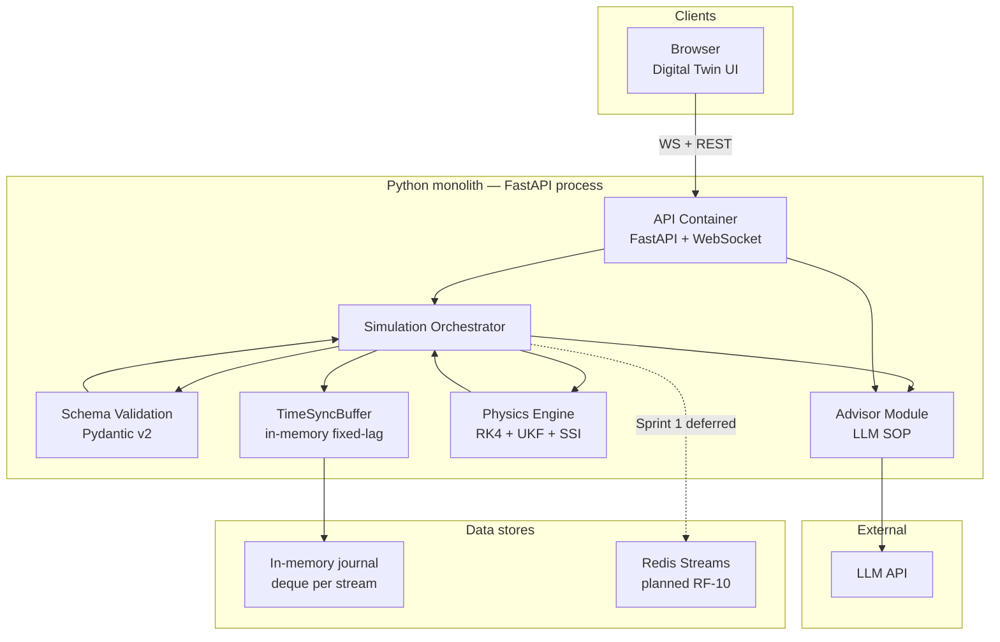

# C4 — Nivel 2: Contenedores

**Proyecto:** Drilling Telemetry Engine · **ADI TP2**  
**SSOT:** [`SPEC.md`](../../SPEC.md) · **ADR:** [`ADR-001`](../../adr/ADR-001-stack-tecnologico.md), [`ADR-002`](../../adr/ADR-002-estilo-arquitectonico.md), [`ADR-003`](../../adr/ADR-003-persistencia.md)

Vista de **contenedores**: aplicaciones, servicios y stores desplegables. Coherente con monolito modular (ADR-002).

---

## Diagrama

---

## Contenedores

| Contenedor | Tecnología | Responsabilidad | Trazabilidad |
|------------|------------|-----------------|--------------|
| Digital Twin UI | Next.js 15, R3F, TS strict | Visualización 3D, gauges, advisor feed | RF-08, RF-09 · ADR-001 |
| API | FastAPI, uvicorn | REST control, WebSocket broadcast ~60 FPS | RF-08 · `src/pipeline/api/` |
| Simulation Orchestrator | Python async | Lazo 100 Hz, fusion UKF, fixed-lag MWD | RF-01, RF-02, RF-05 · `simulation_orchestrator.py` |
| Schema Validation | Pydantic v2 | Borde: rechazar telemetría inválida | RF-12 · `schema_validation.py` |
| TimeSyncBuffer | `deque` in-memory | Journal MWD + fixed-lag replay | RF-02 · ADR-003 |
| Physics Engine | NumPy, código propio | RK4, Stribeck FEM, UKF, SSI | RF-03…RF-06 · `src/engine/` |
| Advisor Module | Python + prompts | Evento `SSI > 1.0` → SOP LLM | RF-07 · `src/advisor/` |
| In-memory journal | Proceso Python | Buffer temporal superficie/MWD | ADR-003 (Sprint 1) |
| Redis Streams | Redis 7 (compose) | Buffer durable planificado | RF-10 · ADR-001/003 (diferido Sprint 1) |
| LLM API | Proveedor externo | Generación texto SOP | RF-07 · NG-04 |

---

## Patrón arquitectónico

**Monolito modular por dominio** (ADR-002): un proceso Python despliega pipeline + advisor + engine; el UI es cliente separado. No hay microservicios en Sprint 1.

---

## Notas de despliegue

| Artefacto | Sprint 1 | Referencia |
|-----------|----------|------------|
| `docker-compose.yml` | `api` + `redis` planificado (RF-10) | ADR-003 |
| Buffer activo | `TimeSyncBuffer` in-memory | NG implícito RF-10 diferido |
| Persistencia histórica | Non-Goal NG-09 | Sin SQL en Sprint 1 |

Flujo de streaming detallado: [`DIAGRAMAS_C4.md`](DIAGRAMAS_C4.md) §3.
