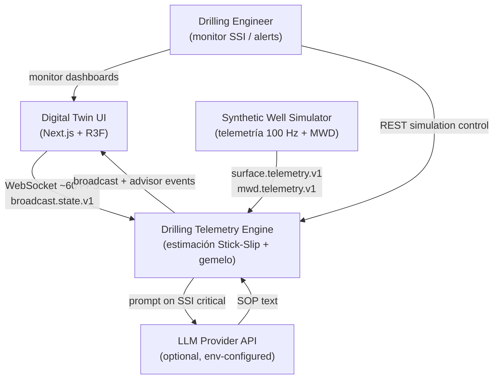

# C4 — Nivel 1: Contexto

**Proyecto:** Drilling Telemetry Engine · **ADI TP2**  
**SSOT:** [`SPEC.md`](../../SPEC.md) · **ADR:** [`ADR-001`](../../adr/ADR-001-stack-tecnologico.md), [`ADR-002`](../../adr/ADR-002-estilo-arquitectonico.md)

Vista de **contexto**: el sistema como caja negra, actores humanos y sistemas externos. Todo elemento aparece en SPEC o ADR (sin cajas fantasma).

---

## Diagrama

---

## Elementos

| Elemento | Tipo | Trazabilidad |
|----------|------|--------------|
| Drilling Engineer | Persona | SPEC §1.1 — operador que monitorea Stick-Slip |
| Digital Twin UI | Sistema externo (cliente) | RF-08, RF-09 · ADR-001 (Next.js/R3F) |
| Drilling Telemetry Engine | **Sistema en alcance** | SPEC completo |
| Synthetic Well Simulator | Fuente de telemetría sintética | NG-02 (no pozo real) · `src/engine/simulator/` |
| LLM Provider API | Sistema externo opcional | RF-07 · NG-04 (mock permitido Sprint 1) |

---

## Protocolos en el borde

| Interfaz | Protocolo | Contrato |
|----------|-----------|----------|
| UI ↔ Engine | WebSocket + REST | `broadcast.state.v1`, envelope WS, `/api/v1/simulation` |
| Simulator → Engine | In-process (Sprint 1) / ingest schemas | `surface.telemetry.v1`, `mwd.telemetry.v1` |
| Engine → LLM | HTTPS API | Prompts SOP (`src/advisor/prompts/`) |

Detalle de contenedores internos: [`C4-contenedores.md`](C4-contenedores.md). Flujos ampliados: [`DIAGRAMAS_C4.md`](DIAGRAMAS_C4.md).
