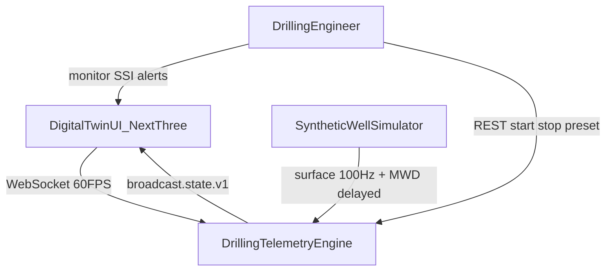
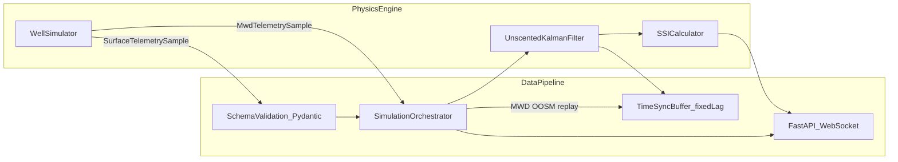
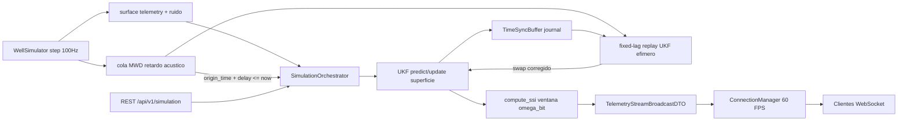

# Diagramas C4 — Drilling Telemetry Engine (Sprint 1)

**SSOT:** [`SPEC.md`](../../SPEC.md) · **Auditoría:** [`docs/auditoria/auditoria-sprint1.md`](../auditoria/auditoria-sprint1.md)

Este documento describe el flujo de datos de **streaming e ingesta** (`src/pipeline/`) y su relación con el Physics Engine.

---

## 1. Contexto (C4 nivel 1)

---

## 2. Contenedores (C4 nivel 2)

**Nota de alcance (Sprint 1):** Redis Streams (RF-10) queda diferido; el buffer en memoria `deque` cubre la sincronización temporal MWD↔superficie para el fixed-lag smoothing.

---

## 3. Flujo de streaming (detalle)

### Tasas

| Camino | Tasa | Contrato |
|--------|------|----------|
| Física / superficie | 100 Hz (`dt=0.01 s`) | `surface.telemetry.v1` |
| MWD | ~0.05 Hz + retardo 15–45 s | `mwd.telemetry.v1` |
| Broadcast gemelo | ~60 FPS | `broadcast.state.v1` |

### Contratos materializados

- [`docs/contratos/surface_telemetry.json`](../contratos/surface_telemetry.json)
- [`docs/contratos/mwd_telemetry.json`](../contratos/mwd_telemetry.json)
- [`docs/contratos/telemetry_stream_broadcast.json`](../contratos/telemetry_stream_broadcast.json)

### Backpressure WebSocket

Cada cliente tiene una `asyncio.Queue` acotada (`maxsize=2`, política *drop-oldest*). Un cliente lento no bloquea el broadcast ni acumula memoria ilimitada.
