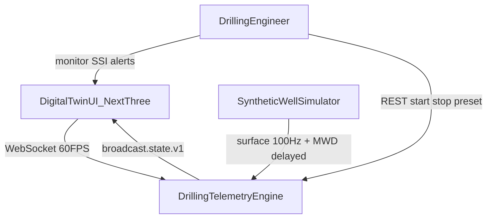
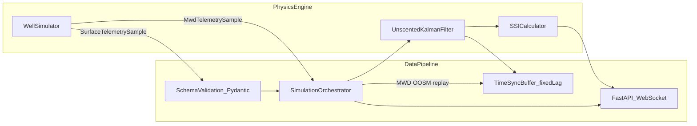
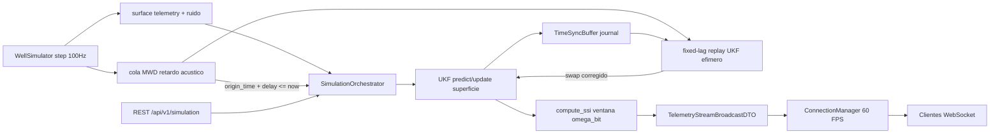
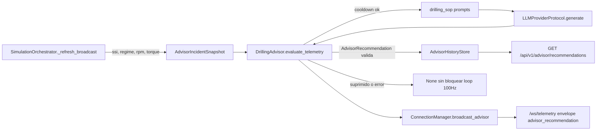

# Diagramas C4 — Drilling Telemetry Engine (Sprint 1)

**SSOT:** [`SPEC.md`](../../SPEC.md) · **Auditoría:** [`docs/auditoria/auditoria-sprint1.md`](../auditoria/auditoria-sprint1.md)

Este documento describe el flujo de datos de **streaming e ingesta** (`src/pipeline/`) y su relación con el Physics Engine.

---

## 1. Contexto (C4 nivel 1)



---

## 2. Contenedores (C4 nivel 2)



**Nota de alcance (Sprint 1):** Redis Streams (RF-10) queda diferido; el buffer en memoria `deque` cubre la sincronización temporal MWD↔superficie para el fixed-lag smoothing.

---

## 3. Flujo de streaming (detalle)



### Tasas

| Camino | Tasa | Contrato |
|--------|------|----------|
| Física / superficie | 100 Hz (`dt=0.01 s`) | `surface.telemetry.v1` |
| MWD | ~0.05 Hz + retardo 15–45 s | `mwd.telemetry.v1` |
| Broadcast gemelo | ~60 FPS | `broadcast.state.v1` |

### Contratos materializados

- [`docs/contratos/surface_telemetry.json`](../contratos/surface_telemetry.json)
- [`docs/contratos/mwd_telemetry.json`](../contratos/mwd_telemetry.json)
- [`docs/contratos/telemetry_stream_broadcast.json`](../contratos/telemetry_stream_broadcast.json)

### Backpressure WebSocket

Cada cliente tiene una `asyncio.Queue` acotada (`maxsize=2`, política *drop-oldest*). Un cliente lento no bloquea el broadcast ni acumula memoria ilimitada.

### Envelope WebSocket (wire format)

Los mensajes en `/ws/telemetry` usan un envelope discriminado:

```json
{"type": "telemetry_frame", "data": { /* broadcast.state.v1 */ }}
{"type": "advisor_recommendation", "data": { /* AdvisorRecommendationRecordDTO */ }}
```

---

## 4. Advisor LLM (Capa 4)



| Pieza | Rol |
|-------|-----|
| `src/advisor/schemas.py` | Snapshot / Recommendation tipados + límites seguros |
| `src/advisor/prompts/drilling_sop.py` | System/user prompts SOP + `sanitize_numeric` |
| `src/advisor/llm_diagnostics.py` | `DrillingAdvisor` + mock/adaptadores LLM |
| `src/pipeline/api/advisor_store.py` | Historial REST |
| Trigger | `SSI > 1.0`, fire-and-forget + cooldown 30 s |

El Advisor **no** bloquea el lazo RK4/UKF: se dispara con `asyncio.create_task` desde el tick de broadcast.
