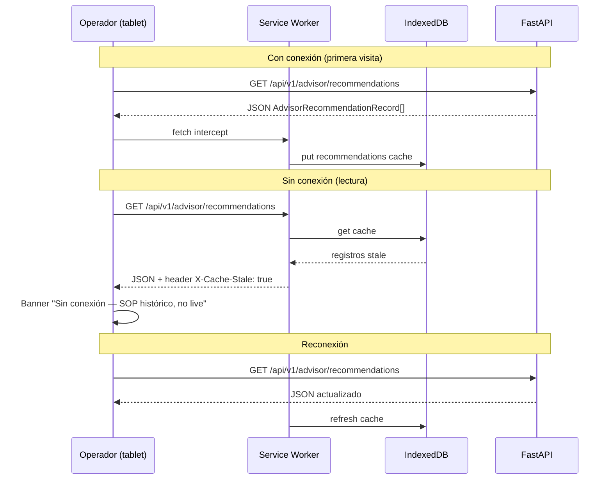

# Offline — Non-Goal justificado

**Proyecto:** Drilling Telemetry Engine · ADI TP5  
**Decisión:** **No offline-first** para el MVP PP3 / Sprint 1–2  
**ADR:** [ADR-006](../adr/ADR-006-estrategia-mobile.md)

---

## Non-Goal declarado

**NG-MOBILE-01 — Monitoreo Stick-Slip offline (sin conexión live)**

El gemelo digital **no** garantiza operación offline ni sincronización diferida de telemetría/UKF/SSI. Sin WebSocket activo hacia `/ws/telemetry`, la UI no presenta estado estimado en tiempo real.

| Aspecto | Sin red |
|---------|---------|
| SSI / `alert_level` | No actualizable (derivan del motor físico en servidor) |
| Deformación 3D nodal | Sin frames `broadcast.state.v1` |
| LLM Advisor SOP | No dispara sin pipeline; historial REST no sustituye alerta live |
| Controles simulación | `POST /simulation/*` fallan sin API |

---

## Motivo (dominio drilling)

1. **Valor = soft real-time.** Stick-slip se diagnostica en ventanas de segundos; un frame congelado de 30 s atrás puede mostrar SSI “normal” mientras el pozo ya está en régimen crítico.
2. **UKF en servidor.** El cliente no recalcula estado (ARCH-04 / RF-09); cache offline solo mostraría **último frame obsoleto** sin marca de obsolescencia fuerte → riesgo operativo para Persona B (toolpusher).
3. **Personas TP3.** Martín opera en sala con red de rig; Claudia usa tablet en **cabina conectada**. Uso “campo sin red” no es journey crítico Sprint 1.
4. **Costo 1 desarrollador.** Cola sync + resolución de conflictos WS/REST compite con núcleo RK4/UKF (prioridad P1 PP3).
5. **NG-02 / NG-08.** Sin SCADA de campo ni app móvil corporativa en MVP.

---

## Qué sí ocurre sin red (degradación honesta)

| Comportamiento | Diseño actual / TP3 |
|----------------|---------------------|
| WS cae | `ConnectionBadge`: `disconnected` / `reconnecting` + timestamp último frame |
| REST falla | `SimulationControls` muestra `sim-error` |
| Advisor vacío | Empty state contextual (no es offline, es umbral SSI) |

No hay service worker ni IndexedDB de telemetría en Sprint 1.

---

## Condición que reabriría offline

Reevaluar **PWA + cache read-only** o **sync cola** si:

| Trigger | Estrategia mínima |
|---------|-------------------|
| Operador exige consultar **último SOP** en zona sin cobertura (pozo remoto) | Cache HTTP / IndexedDB de `GET /advisor/recommendations` + banner “solo histórico” |
| Regulador exige bitácora local de alertas | Cola de eventos `alert_level: critical` con sync al reconectar |
| Integración tablet offline en vehículo de campo | PWA instalable (ADR-006) + shell cacheado; **stream live sigue requiriendo red** |

En ese caso: actualizar ADR-006, agregar diagrama de sync abajo, y nuevo ADR si se introduce service worker.

---

## Diagrama de secuencia (futuro — solo si se activa offline read-only)

Escenario hipotético: cache de recomendaciones SOP para lectura sin red (no implementado).

---

## Trazabilidad

| Documento | Relación |
|-----------|----------|
| [`SPEC.md`](../../SPEC.md) §1.3 NG-08 | App móvil / auth fuera MVP |
| [`SPEC.md`](../../SPEC.md) §1.6 RNF | Presupuestos asumen red 4G |
| Threat model T-01 | WS requiere auth en prod |

---

*Offline Non-Goal · ADI TP5 · Argumentado — no silencio*
