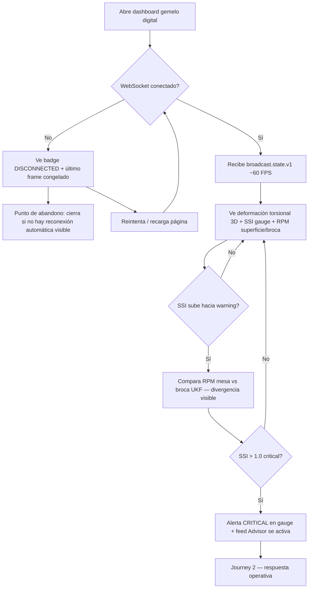
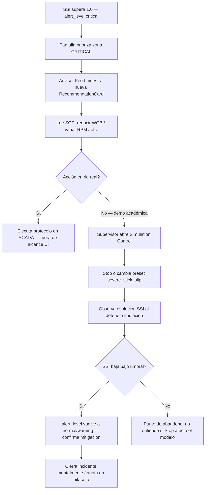

# Usuarios y journeys — Drilling Telemetry Engine

**Proyecto:** `lautaro_lopez-drilling-telemetry-engine`  
**Asignatura:** ADI · IES 9-018 · Ciclo 2026  
**Entrega:** TP3 — Diseño de interfaces y HCI  
**Dominio:** monitoreo Stick-Slip en perforación petrolera profunda (gemelo digital)

---

## 1. Personas

### Persona A — Ingeniero de perforación (Drilling Engineer)

| Atributo | Detalle |
|----------|---------|
| **Nombre ficticio** | Martín Rojas |
| **Edad / rol** | 34 años · ingeniero de perforación en operador Upstream (Vaca Muerta) |
| **Contexto** | Monitorea RPM superficie vs broca estimada por UKF durante rotación continua y sliding. La telemetría MWD llega con 15–45 s de retardo; depende del gemelo para anticipar stick-slip antes de daño en BHA. |
| **Objetivos** | Detectar SSI elevado en ventana deslizante; comparar RPM superficie/broca; validar que la deformación torsional 3D coincida con la física del pozo. |
| **Frustraciones** | SCADA de rig muestra solo RPM de mesa; no fusiona MWD con superficie. Alertas genéricas sin severidad cuantificada. Interfaces con latencia > 1 s inútiles para soft real-time. |
| **Competencia digital** | Alta en herramientas de pozo (WITSML viewers, dashboards internos); tolera dashboards densos si las unidades son explícitas (`_knm`, `_rad_s`). |
| **Dispositivo** | Laptop en sala de control del rig (1920×1080, posible brillo alto / reflejos). |
| **Frecuencia de uso** | 4–6 h diarias durante perforación de sección crítica. |

### Persona B — Supervisor de operaciones de pozo (Toolpusher / Rig Supervisor)

| Atributo | Detalle |
|----------|---------|
| **Nombre ficticio** | Claudia Méndez |
| **Edad / rol** | 48 años · toolpusher con 20 años en rigs terrestres |
| **Contexto** | Responsable de NPT y seguridad mecánica. No ejecuta el modelo UKF; debe **actuar** cuando stick-slip es crítico: reducir WOB, variar RPM, activar protocolo anti-stick-slip del operador. |
| **Objetivos** | Ver alerta `critical` sin ambigüedad; leer recomendación SOP del LLM Advisor en &lt; 30 s; confirmar que la simulación/demo refleja el escenario `severe_stick_slip` para capacitación. |
| **Frustraciones** | Alarmas SCADA sin contexto operativo (“high torque” sin índice SSI). Documentos SOP en PDF separados del HMI. Pantallas 3D sin etiquetas legibles para personal no especialista en simulación. |
| **Competencia digital** | Media-alta en HMI de rig; prefiere semáforos, texto grande y acciones con una sola pulsación (Start/Stop demo). |
| **Dispositivo** | Monitor touch en cabina + tablet ocasional. |
| **Frecuencia de uso** | Picos durante eventos de stick-slip (minutos críticos); revisión diaria de bitácora de alertas. |

---

## 2. User journeys (flujos críticos)

### Journey 1 — Monitoreo continuo del gemelo (Persona A)

Flujo principal: conectar WS, observar deformación 3D y gauges, correlacionar SSI con RPM dual.

**Qué ve el sistema en cada paso**

| Paso | UI / datos |
|------|------------|
| A | Layout: canvas 3D (7 cols) + panel métricas (5 cols) + Advisor abajo |
| B | `ConnectionBadge`: `connected` / `reconnecting` / `disconnected` |
| F | `frame_id`, `ukf_state.omega_rad_s[]`, `torsional_deformation_rad[]`, `ssi`, `alert_level` |
| G | `SsiGauge`, `RpmDualGauge`, `DrillStringCanvas` animado |
| K | `alert_level: critical`, evento `advisor_recommendation` en WS envelope |

**Puntos de abandono**

1. Desconexión WS sin mensaje de reconexión ni timestamp del último frame válido.
2. Canvas 3D vacío o “Loading…” prolongado sin progreso (&gt; 5 s).
3. SSI mostrado sin unidad ni escala (usuario no distingue warning vs critical).

---

### Journey 2 — Respuesta a stick-slip crítico y SOP (Persona B)

Flujo disparado por `SSI > 1.0`: priorizar alerta, leer Advisor, opcionalmente pausar demo.

**Qué ve el sistema en cada paso**

| Paso | UI / datos |
|------|------------|
| A | Backend emite `alert_level: critical`; Advisor debounce dispara LLM/mock |
| B | Badge `CRITICAL` en SSI + borde/acento rojo en gauge (wireframe v2) |
| C | `AdvisorRecommendationRecord`: `triggered_at`, `ssi`, texto SOP, `provider` |
| G | `SimulationControls`: Start/Stop + presets `normal` / `severe_stick_slip` / `transient_choke` |
| I | `status.sim_time_s`, `status.running`, frames WS posteriores |

**Puntos de abandono**

1. Advisor vacío tras alerta crítica (usuario no sabe si falló LLM o no hay SOP).
2. Botones Start/Stop sin feedback `busy` / error (`sim-error`).
3. Presets con nombres técnicos (`severe_stick_slip`) sin etiqueta humana.

---

## 3. Trazabilidad a requerimientos

| Journey | RF / contrato |
|---------|---------------|
| Journey 1 | RF-08 (`broadcast.state.v1`), RF-09 (visualización 3D), RF-06 (SSI) |
| Journey 2 | RF-07 (alerta + Advisor), RF-08, controles REST simulación |

Wireframes: [`wireframes/dashboard-gemelo-digital.md`](wireframes/dashboard-gemelo-digital.md), [`wireframes/alerta-stick-slip-advisor.md`](wireframes/alerta-stick-slip-advisor.md).
